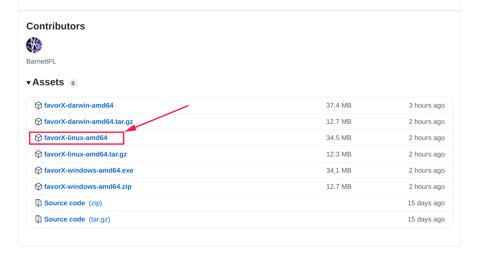
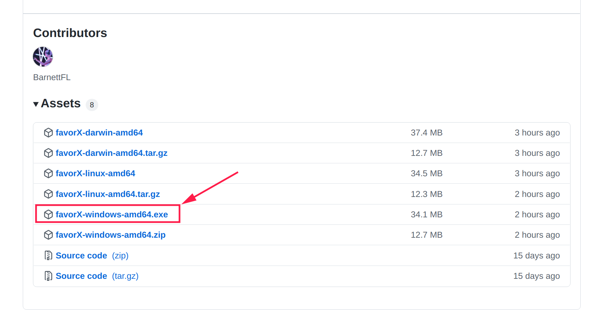
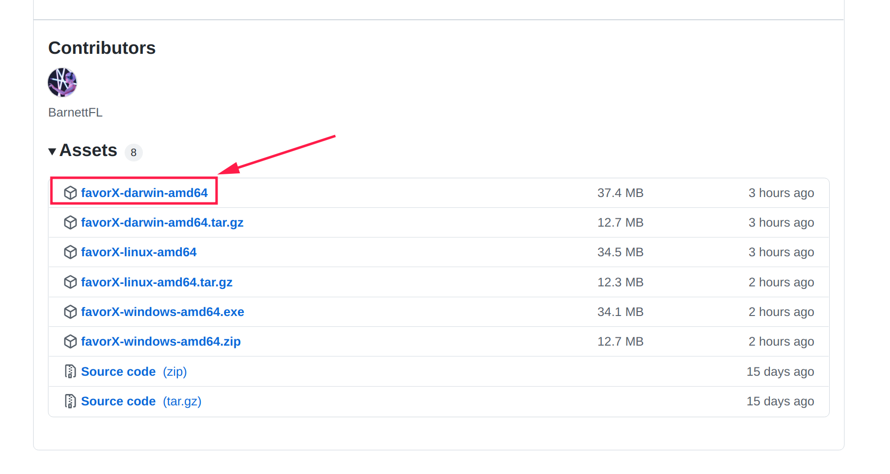

import Tabs from '@theme/Tabs';
import TabItem from '@theme/TabItem';

# Launch FavorX

## Launching Flow

FavorX has been packaged, you can follow the process below to start the node.

<Tabs
    defaultValue="ubuntu"
    values={[
    {label:'Ubuntu',value:'ubuntu'},
    {label:'Windows',value:'windows'},
    {label:'MacOS',value:'mac'},
]}>

<TabItem value="ubuntu">

### Download FavorX


Obtain the favorX startup file at the following address and execute it under the ubuntu system.


[https://github.com/FavorLabs/favorX/releases](https://github.com/FavorLabs/favorX/releases)



### Add execute permission

After downloading the startup file, add execute permission to the startup file.

```
chmod +x ./favorX-linux-amd64
```

### Create a new config profile

First, create a new yaml file and paste the previously read configuration into it.

```
./favorX-linux-amd64 printconfig &> ./favorX.yaml 
```

### Launch

Before launching, you must set the [configuration](configuration.md) properly.  
Then execute the following command to start the node normally.

```
./favorX-linux-amd64 start --config ./favorX.yaml 
```

After the initialization is completed, the corresponding address account will be generated and a password will be set. Please keep your password properly.


</TabItem>
<TabItem value='windows'>

### Download FavorX

Obtain the favorX startup file at the following address and execute it under the windows system.


[https://github.com/FavorLabs/favorX/releases](https://github.com/FavorLabs/favorX/releases)



### Create a new config profile

First, execute following commad so you can create a new yaml file which contains the basic configuration into it

```bash
favorX-windows-amd64.exe printconfig > favorX.yaml  2>&1
```

### Launch

Before launching, you must set the [configuration](configuration.md) properly.
Then, execute the following command to start the node normally.

```bash
favorX-windows-amd64.exe start --config favorX.yaml
```

</TabItem>

<TabItem value="mac">

### Download FavorX


Obtain the favorX startup file at the following address and execute it under the mac system.


[https://github.com/FavorLabs/favorX/releases](https://github.com/FavorLabs/favorX/releases)



### Add execute permission

After downloading the startup file, add execute permission to the startup file.

```
chmod +x ./favorX-darwin-amd64
```

### Create a new config profile

First, create a new yaml file and paste the previously read configuration into it.

```
./favorX-darwin-amd64 printconfig &> ./favorX.yaml 
```

### Launch

Before launching, you must set the [configuration](configuration.md) properly.  
Then execute the following command to start the node normally.

```
./favorX-darwin-amd64 start --config ./favorX.yaml 
```

After the initialization is completed, the corresponding address account will be generated and a password will be set. Please keep your password properly.


</TabItem>

</Tabs>


