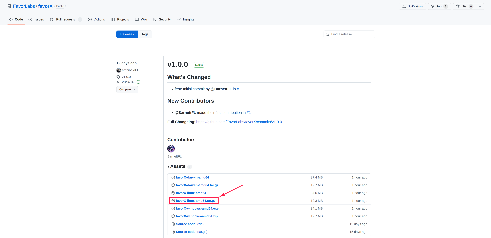
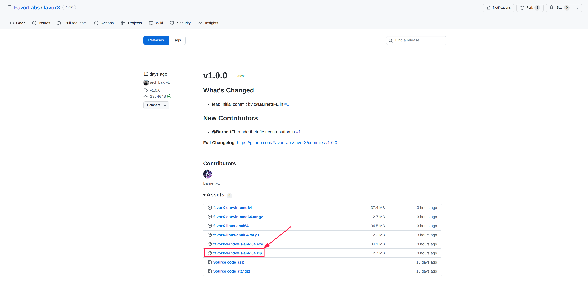
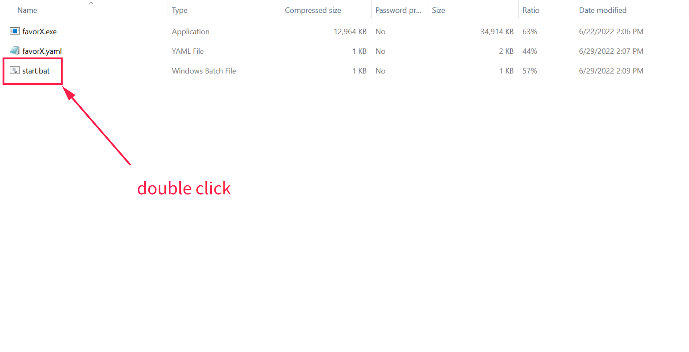
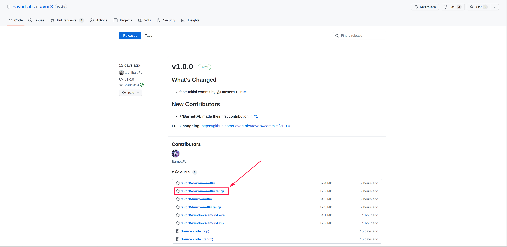

import Tabs from '@theme/Tabs';
import TabItem from '@theme/TabItem';

# Quick Start

## Launching Flow

FavorLabs has been packaged, you can follow the process below to start the node.

<Tabs
    defaultValue="ubuntu"
    values={[
    {label:'Ubuntu',value:'ubuntu'},
    {label:'Windows',value:'windows'},
    {label:'MacOS',value:'mac'},
]}>

<TabItem value="ubuntu">

### Download FavorX


Obtain the favorX startup file at the following address and execute it under the ubuntu system.

[https://github.com/FavorLabs/favorX/releases](https://github.com/FavorLabs/favorX/releases)



### Untar the tar package

After you untar the tar package, you will find there is a directory named "favorX" which contains three files:

- favorX
- favorX.yaml
- start.sh

Make sure that they are kept in the same directory. 

### Launch

Execute the following commands to start the node normally.

```bash
cd ./favorX
chmod +x start.sh
./start.sh
```


After the initialization is completed, the corresponding address account will be generated and a password will be set. Please keep your password properly.

</TabItem>
<TabItem value='windows'>

### Download FavorX

Obtain the favorX startup file at the following address and execute it under the windows system.

[https://github.com/FavorLabs/favorX/releases](https://github.com/FavorLabs/favorX/releases)



### Unzip the zip file

After unzipping the zip file, you will find there is a directory named "favorX" which contains three files:

- favorX.exe
- favorX.yaml
- start.bat

Make sure that they are kept in the same directory. 

### Launch

**Just open "start.bat", the node will be started.**


After the initialization is completed, the corresponding address account will be generated and a password will be set. Please keep your password properly.
 

</TabItem>

<TabItem value='mac'>

### Download FavorX


Obtain the favorX startup file at the following address and execute it under the mac system.

[https://github.com/FavorLabs/favorX/releases](https://github.com/FavorLabs/favorX/releases)



### Untar the tar package

After you untar the tar package, you will find there is a directory named "favorX" which contains three files:

- favorX
- favorX.yaml
- start.sh

Make sure that they are kept in the same directory. 

### Launch

Execute the following commands to start the node normally.

```bash
cd ./favorX
chmod +x start.sh
./start.sh
```

After the initialization is completed, the corresponding address account will be generated and a password will be set. Please keep your password properly.

</TabItem>
</Tabs>

